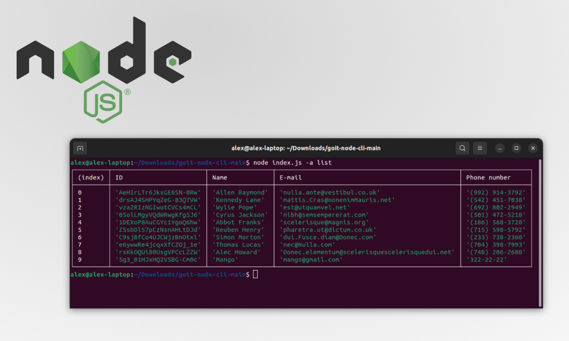
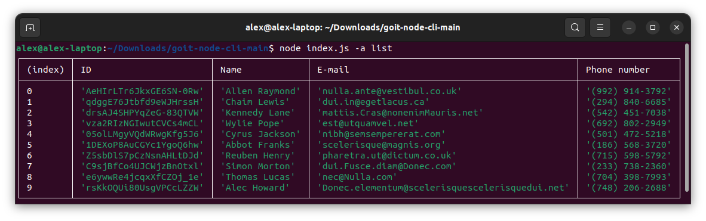
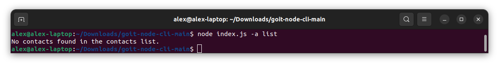
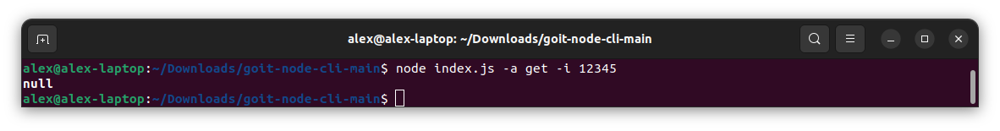
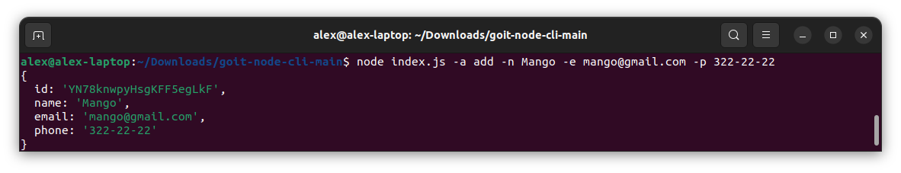
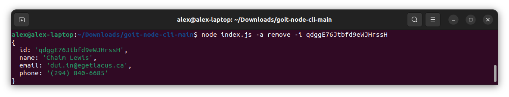
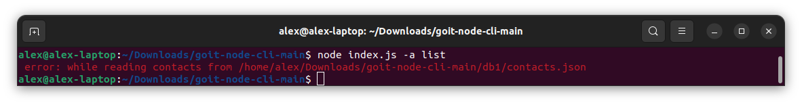
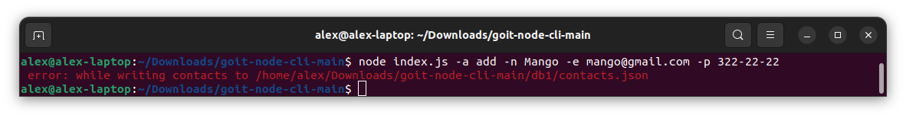
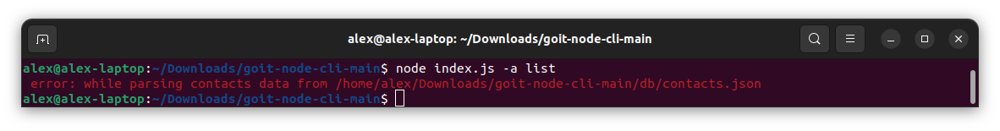
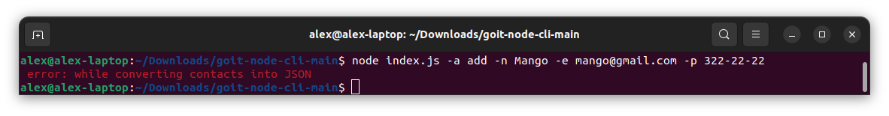

# Contacts management CLI application

#### goit-node-cli

<p align="center">
  
</p>


<h4 align="center">
  Command-line application to store and manage your contacts.
</h4>


## Project description

Store and manage your contacts using a command-line interface: 

* Display the entire list of stored contacts
* Retrieve specific contacts by ID
* Add new contacts
* Remove existing contacts

## Quickstart

1) Download the files from the [repository](https://github.com/oleksandr-romashko/goit-node-cli).
2) Make sure you have the [latest Node.js LTS version](https://nodejs.org/en/download/package-manager) installed on your machine. 
3) Install the application dependencies using the `npm install` command in your terminal.

## Usage

1) Retrieves and displays the entire list of contacts as a table (console.table):
    ```bash
    node index.js -a list
    ```
    <p align="center">
      
    </p>
    <p align="center">
      
    </p>
2) Retrieves a contact by ID and logs the contact object to the console or null if a contact with that ID does not exist:
    ```bash
    node index.js -a get -i 05olLMgyVQdWRwgKfg5J6
    ```
    <p align="center">
      
    </p>
    <p align="center">
      
    </p>
3) Adds a contact and logs the newly created contact object to the console:
    ```bash
    node index.js -a add -n Mango -e mango@gmail.com -p 322-22-22
    ```
    <p align="center">
      
    </p>
    There is no check for duplicates.
4) Removes a contact and logs the deleted contact object to the console or null if a contact with that ID does not exist:
    ```bash
    node index.js -a remove -i qdggE76Jtbfd9eWJHrssH
    ```
    <p align="center">
      
    </p>
    <p align="center">
      
    </p>
5) Errors while reading from / writing to db file or parsing / stringifying json:
    <p align="center">
      
    </p>
    <p align="center">
      
    </p>
    <p align="center">
      
    </p>
    <p align="center">
      
    </p>